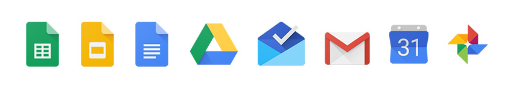

# Alfred Workflow for Google Apps
A simple workflow for accessing Google Apps.

## Installation
To install simply download the [GoogleApps.alfredworkflow](GoogleApps.alfredworkflow?raw=true) file and double click to install in Alfred.

> Note: You will have to deactivate Gmail and Drive from the default URL searches provided in Alfred to remove duplicates.

## Usage
**Easy access**
* `books` to open your Google Play Books
* `books store` to the Google Play Store
* `calendar` to open Google Calendar
* `contacts` to open Google Contacts
* `docs` to open Google Docs
* `drive` to open Google Drive
* `forms` to open Google Forms
* `gmail` to open Gmail
* `inbox` to open Google Inbox
* `music` to open Google Play Music
* `keep` to open Google Keep
* `passwords` to open Google Passwords
* `photos` to open Google Photos
* `slides` to open Google Slides
* `sheets` to open Google Sheets

**New document**
* `new doc` to create a new Google Doc
* `new sheet` to create a new Google Sheet
* `new slide` to create a new Google Slide
* `new form` to create a new Google Form

**Search**
* `music` to search Google Play Music
* `contacts` to search Google Contacts

Raise an issue if you have an idea for a feature request!
